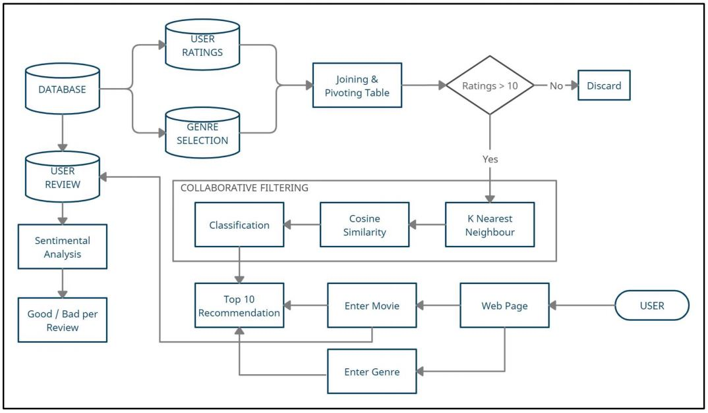

## Movie Recommendation System (Website)
Movie Recommendation System created using Collaborative Filtering (Website) and Content based Filtering (Jupyter Notebook).Content Based Recommender System recommends movies similar to the movie user likes and analyses the sentiments on the reviews given by the user for that movie.

### Objectives

  1. To create a movie recommendation system using Collaborative Filtering and machine learning algorithms such as K Nearest Neighbours. 
  2. The system should recommend movies based on the movie title entered by the user. 
  3. The system should also be able to recommend movies on the basis of 'genre only' and 'genre and year' entered. 
  4. The system should apply sentiment analysis to categorize user comments on a particular movie.
  5. Additional Content Based Filtering is performed (can be seen [here](Recommovie_9604_Notebook.ipynb)) using Neural Network to perform Matrix Factorization.

### Dataset can be accessed from [here](https://grouplens.org/datasets/movielens/). 
  For redcuing the deployment time, data exploration followed by feature selection is done on the complete dataset.

### Features of the System

### Tech Stack
  1. Python
  2. Flask
  3. JavaScript
  4. Nltk

### Novelty

### Flow Diagram

### Deployment
  - The application deployed can be accessed and tested directly from [here](https://recommedationmovie.herokuapp.com/) or https://recommedationmovie.herokuapp.com/
